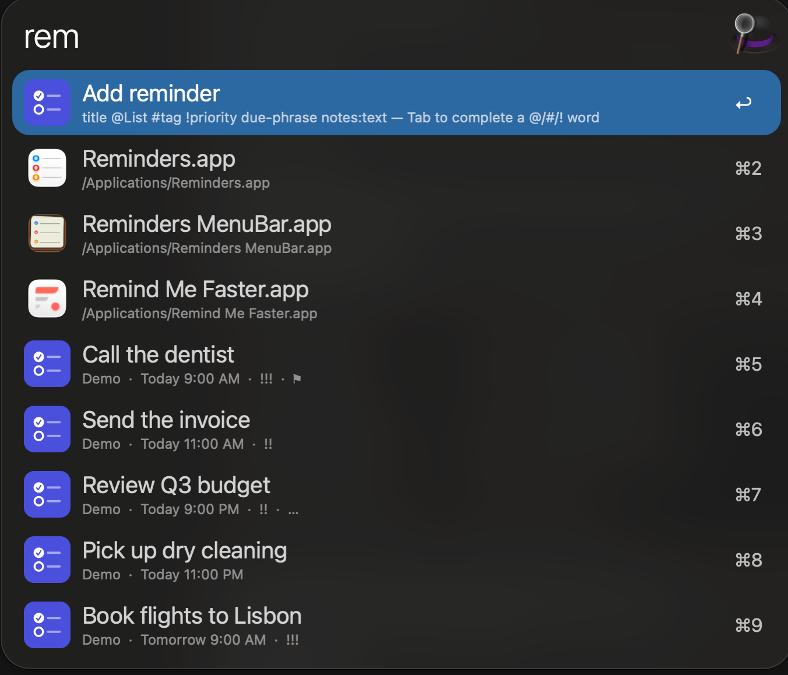
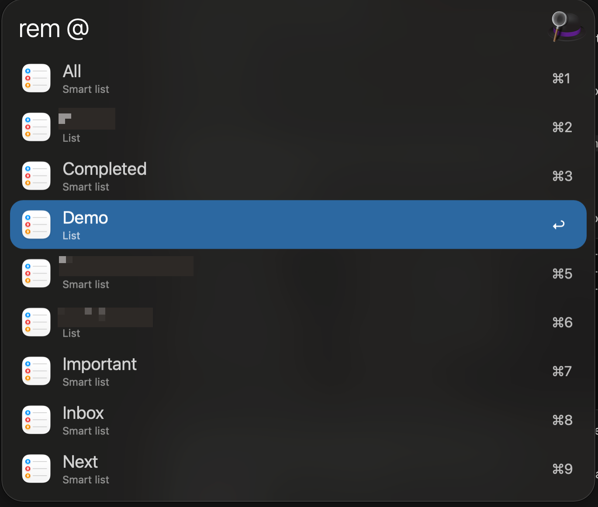
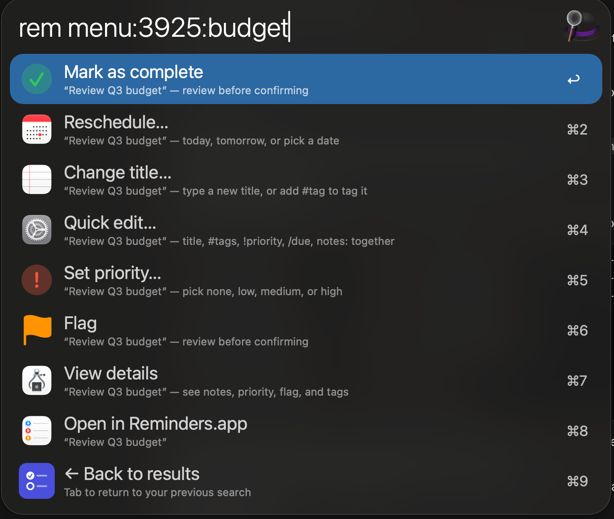

# Reminders for Alfred

Search, add, complete and edit your Apple Reminders without leaving Alfred.

Everything happens in the Alfred window — no switching to Reminders.app to
reschedule something or tick it off. Changes sync through Apple's own
Reminders database, so they show up on your iPhone and iPad like any other
edit.



## Usage

Browse and search your reminders via the `rem` keyword.

Typing `rem` on its own shows what's **due today, plus anything overdue**.
Add a scope or some text to narrow it down:

| Query | Shows |
|---|---|
| `rem` | Due today + overdue |
| `rem milk` | Search every list (title and notes) |
| `rem @Work` | One list — or a smart list |
| `rem @` | Pick from a list of your lists |
| `rem #errand` | Everything with that tag |
| `rem #` | Pick from your tags |
| `rem all` | Every open reminder |
| `rem upcoming` | Due in the next 7 days (`rem upcoming 14` for a fortnight) |
| `rem flagged` | Flagged only |
| `rem overdue` | Overdue only |

`@` and `#` complete as you type — `rem @Gro` narrows to matching lists,
and <kbd>⇥</kbd> fills in the full name.




### Acting on a reminder

Press <kbd>↩</kbd> or <kbd>⇥</kbd> on any reminder to open its action menu:

| Action | |
|---|---|
| **Mark as complete** | |
| **Reschedule…** | Today, Tomorrow, or type any date |
| **Change title…** | Add `#tags` while you're there |
| **Quick edit…** | Title, tags, priority, due date and notes in one line |
| **Set priority…** | None / Low / Medium / High |
| **Flag** / **Unflag** | |
| **View details** | Everything about the reminder, read-only |
| **Open in Reminders.app** | |



Every screen has a **← Back** row except the final confirmation
(backspace to cancel that one), and Back from the action menu returns you
to *the exact search you came from*, not a blank `rem`.

There's no delete — that's deliberate. Use Reminders.app if you need it.

### Quick edit

The one worth knowing about. **Quick edit…** puts the whole reminder on a
single editable line, pre-filled with its current state:

```
Buy milk #errand !high /2026-09-08 09:00 notes: pick up eggs too
```

Change what you want, leave the rest alone, press <kbd>↩</kbd>. Deleting a
marker clears that field — remove `!high` and the priority goes back to
none. It saves the menu → field → confirm → navigate-back loop when you're
changing several things at once.

### Adding reminders

Add via the `remadd` keyword:

```
remadd Buy milk @Groceries tomorrow 9am
remadd Ship the deck @Work !high friday 3pm #urgent
remadd Pay rent /2026-06-01 notes:autopay is off this month
```

| Marker | Meaning |
|---|---|
| `@List` | Which list (single-word names only) |
| `#tag` | Repeatable — but see Limitations: on `remadd` these stay literal text |
| `!high` `!medium` `!low` | Priority (`!h` `!m` `!l` work too) |
| `notes:…` | The notes — but stops at the next `@`, `#`, `!` or date marker (see below) |

**The due date needs no marker at all.** A trailing date phrase is
detected automatically: `tomorrow`, `tom`, `next friday`, `9am`,
`2026-06-01`, `+3d`, `9/13`, `sep 9`, even glued forms like `tom9am` or
`sep9`. If a title genuinely ends in something date-like and gets
misread, put `/` in front of the real date to force it —
`remadd Review the Monday numbers /friday`.

**`notes:` stops early if a marker follows it.** `notes:` runs to the end
of what you type *unless* it hits another `@List`, `#tag`, `!priority` or
date marker — those still register, and any plain words after them go
back to the **title**, not the notes. So
`remadd Buy milk notes:ask about !high volume orders` gives you a title of
"Buy milk volume orders", notes of "ask about", and high priority. If your
note needs one of those characters, put `notes:` last, or add the note in
Reminders.app.

`@`, `#` and `!` all complete as you type, and the subtitle previews
exactly how your text is being interpreted before you commit.

### Clearing a backlog

```
rem overdue tomorrow
```

Reschedules **every** overdue reminder to tomorrow in one go, keeping each
one's time of day (a 9am reminder stays 9am). `rem overdue today` does the
same for today. This always asks for confirmation, even if you've turned
confirmations off.

One thing to know: rescheduling to *today* keeps the original time, so a
reminder that was due at 9am this morning stays overdue. The workflow
tells you when that's the case and points you at `tomorrow` instead.

## Setup

**1. Install [remctl](https://github.com/viticci/remctl)**, the command
line tool this is built on:

```bash
git clone https://github.com/viticci/remctl.git
cd remctl
./install.sh --bootstrap --doctor
```

`remctl doctor` will tell you if anything's missing.

**2. Import the workflow.**

**3. Grant permissions — to Alfred, not to Terminal.** This is the step
that trips people up. The grants are per-*process*, so remctl working in
your shell says nothing about whether Alfred can use it. You need two:

- **Reminders access** — trigger `rem` once and approve the macOS prompt.
  If it doesn't appear, add Alfred under **System Settings → Privacy &
  Security → Reminders**.
- **Full Disk Access** — under **System Settings → Privacy & Security →
  Full Disk Access**, add **Alfred** *and* `/usr/bin/python3` (the
  interpreter Alfred runs these scripts with).

Run `remctl doctor` afterwards to confirm both checks pass. Skipping the
Full Disk Access grant is the usual reason everything works in Terminal
and nothing works in Alfred.

## Configuration

All optional, in the workflow's configuration sheet:

| Setting | Default | |
|---|---|---|
| `CONFIRM_CHANGES` | on | Review every change before it's applied. Set to `0` to skip straight to acting. |
| `DEFAULT_SCOPE` | today + overdue | What bare `rem` shows. Set to `@Work`, `upcoming 14`, `flagged`, anything from the table above. |
| `REMCTL_CACHE_TTL` | 5 | Seconds to reuse results while typing. |
| `REMCTL_PATH` | auto | Only if remctl isn't on the usual paths. |

## Limitations

Worth knowing before you install:

**No "move to another list."** It was built, but `remctl`'s underlying
move fails with an EventKit error (`-3002`) on at least one machine,
reproducibly and independently of this workflow. A clone-into-the-new-list-then-delete
workaround works for most fields but loses subtasks,
recurrence, URLs and section placement, and gives the reminder a new
identity — not a good trade for a "move," so the feature was removed
rather than shipped broken.

**Quick edit won't touch a multi-line note.** It's a single-line editor, and
a newline can't survive the round trip — an earlier version silently
flattened a 7-line note into one line. Now it leaves multi-line notes
strictly alone and says so on screen. Title, tags, priority and due date
still edit normally; use Reminders.app to edit the note itself.

**Smart lists are approximated.** remctl can read a smart list's *rules*
but not its contents, so the filter (tags, dates, priority, flagged) is
re-applied here. Apple's built-ins — Today, Urgent, All and Completed —
map to real commands and are exact. Unusual custom filters may not match
Reminders.app perfectly.

**`@List` in `remadd` is single-word only.** `@Work` is fine, `@Home
Projects` isn't — the parser can't tell where a multi-word name ends.
Add it in Reminders.app, or with `remctl add "Title" -l "Home Projects"`.
(`rem` only browses and edits; it can't create.)

**`#tags` behave differently in `remadd` than everywhere else.** Adding a
reminder with `remadd Buy milk #errand` leaves `#errand` as literal text
in the title, not a real tag — remctl only creates proper tags through an
unsupported private API, and `remadd` deliberately doesn't use it when
creating. **Change title…** and **Quick edit…** do, so tagging an
existing reminder gives you a real, synced tag and a clean title.
Verified both ways directly. Because that path is unsupported by Apple,
tagging could break with a macOS update — flagging, and the rest of Quick
edit, use the same mechanism.

**No delete.** By design.

## Requirements

macOS with Alfred (Powerpack) and
[remctl](https://github.com/viticci/remctl). Built and tested against
Alfred 5.7 and remctl 1.7.1. Uses the system Python — nothing else to
install.

## Thanks

Built on [remctl](https://github.com/viticci/remctl) by Federico Viticci.
The interaction design is inspired by
[Alfredo](https://alfred.app/workflows/giovanni/alfredo/), Giovanni's
Todoist workflow.

Built with [Claude Code](https://claude.com/claude-code).

---

Working on the workflow itself? See [docs/INTERNALS.md](docs/INTERNALS.md)
for architecture, the remctl quirks it works around, testing, and
troubleshooting.
